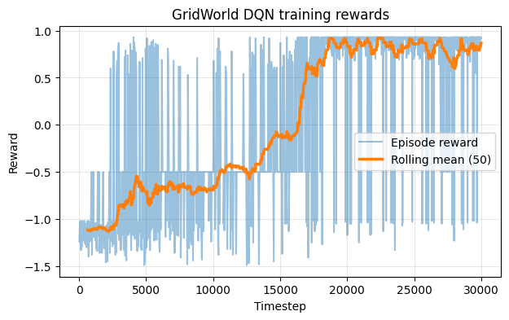
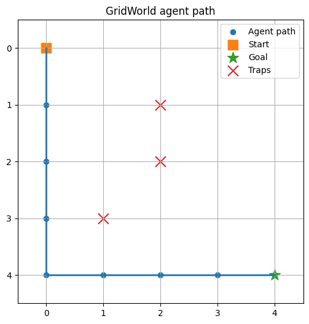
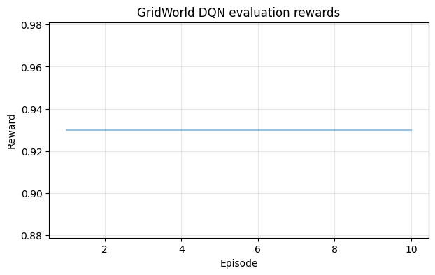

<div align="center">

# GridWorld RL Playground

A small reinforcement learning project with a custom Gymnasium GridWorld environment, DQN training, model evaluation and agent path visualization.


</div>

## Overview

This project shows a complete local reinforcement learning workflow:

```text
custom environment -> training -> saved model -> evaluation -> results CSV -> path visualization
```

The main experiment trains a DQN agent on a custom deterministic GridWorld environment. The same GridWorld setup is also used for a small DQN vs PPO comparison. Selected Gymnasium environments are available as optional CLI hooks, but the primary documented result focuses on the custom GridWorld task.

## Project Goal

The goal was to practice:

- creating a custom Gymnasium environment,
- designing a simple reward function,
- training a DQN agent,
- evaluating the trained policy,
- exporting results,
- visualizing learned behavior.

## Features

- Custom GridWorld environment.
- Fixed start position, traps, goal and step limit.
- DQN training with Stable-Baselines3.
- Configurable training timesteps.
- Evaluation over multiple episodes.
- CSV result export.
- Training reward curve export.
- Agent path visualization.
- Optional seeded random trap generation.
- Optional CLI hooks for PPO, FrozenLake, Acrobot and LunarLander.
- Basic tests for the environment.

## How It Works

```text
GridWorld environment -> DQN training -> saved model -> evaluation -> CSV results -> path visualization
```

## Reward Design

The reward function is intentionally simple:

- positive reward for reaching the goal,
- negative reward for falling into a trap,
- small step penalty to encourage shorter paths,
- truncation after the maximum number of steps.

Current values:

| Event | Reward |
|---|---:|
| Goal reached | 1.0 |
| Trap reached | -1.0 |
| Regular step | -0.01 |

## Results

The current checked run trains both DQN and PPO for 30,000 timesteps on the same fixed GridWorld map, then evaluates each model for 10 episodes.

| Environment | Model | Episodes | Mean reward | Mean steps | Success rate | Optimal path | Learned path |
|---|---|---:|---:|---:|---:|---:|---:|
| GridWorld | DQN | 10 | 0.93 | 8.0 | 100% | 8 | 8 |
| GridWorld | PPO | 10 | -0.50 | 50.0 | 0% | 8 | N/A |

DQN learns the shortest path for this map. PPO is implemented and tested through the same CLI, but with the current simple settings it does not solve this sparse-reward GridWorld task within 30,000 timesteps.

The `0.93` reward comes from reaching the goal with the shortest path: seven regular moves with a `-0.01` step penalty and the final `+1.0` goal reward.

Training curve:





Evaluation rewards:



Generated result files:

```text
models/dqn_gridworld.zip
models/ppo_gridworld.zip
results/gridworld_dqn_rewards.csv
results/gridworld_ppo_rewards.csv
results/gridworld_dqn_training_rewards.csv
results/gridworld_ppo_training_rewards.csv
results/gridworld_agent_path.csv
plots/gridworld_path.png
plots/gridworld_rewards.png
plots/gridworld_dqn_training_rewards.png
plots/gridworld_ppo_training_rewards.png
```

## Evaluation Scope

Evaluation is intentionally simple. It runs a trained deterministic policy on the fixed GridWorld map and reports reward, steps and success rate. That keeps the final behavior easy to verify. The training reward curve is included separately because it shows the learning process, while evaluation shows the final policy behavior.

Success rate, optimal path length and learned path length are reported for the custom GridWorld environment. Optional Gymnasium environments are included mainly for experimentation.

## Project Structure

```text
rl-playground-gridworld/
|-- README.md
|-- LICENSE
|-- requirements.txt
|-- pytest.ini
|-- .github/
|   |-- workflows/
|       |-- tests.yml
|-- models/
|   |-- dqn_gridworld.zip
|   |-- ppo_gridworld.zip
|-- plots/
|   |-- gridworld_path.png
|   |-- gridworld_rewards.png
|   |-- gridworld_dqn_training_rewards.png
|   |-- gridworld_ppo_training_rewards.png
|-- results/
|   |-- gridworld_agent_path.csv
|   |-- gridworld_dqn_rewards.csv
|   |-- gridworld_ppo_rewards.csv
|   |-- gridworld_dqn_training_rewards.csv
|   |-- gridworld_ppo_training_rewards.csv
|-- src/
|   |-- __init__.py
|   |-- evaluate.py
|   |-- plot_results.py
|   |-- train.py
|   |-- visualize.py
|   |-- envs/
|       |-- __init__.py
|       |-- grid_world.py
|-- tests/
|   |-- test_grid_world.py
```

## How to Run

Windows PowerShell:

```powershell
python -m venv .venv
.\.venv\Scripts\Activate.ps1
python -m pip install --upgrade pip
pip install -r requirements.txt

python -m src.train --env gridworld --model dqn --timesteps 30000 --model-path models/dqn_gridworld.zip --training-output results/gridworld_dqn_training_rewards.csv
python -m src.evaluate --env gridworld --model-path models/dqn_gridworld.zip --episodes 10 --output results/gridworld_dqn_rewards.csv
python -m src.visualize --model dqn --model-path models/dqn_gridworld.zip --output plots/gridworld_path.png
```

## Optional: Regenerate Plots

```powershell
python -m src.plot_results --input results/gridworld_dqn_rewards.csv --output plots/gridworld_rewards.png --title "GridWorld DQN evaluation rewards"
python -m src.plot_results --input results/gridworld_dqn_training_rewards.csv --output plots/gridworld_dqn_training_rewards.png --title "GridWorld DQN training rewards" --rolling-window 50
```

## Optional: PPO Comparison

```powershell
python -m src.train --env gridworld --model ppo --timesteps 30000 --model-path models/ppo_gridworld.zip --training-output results/gridworld_ppo_training_rewards.csv
python -m src.evaluate --env gridworld --model ppo --model-path models/ppo_gridworld.zip --episodes 10 --output results/gridworld_ppo_rewards.csv
python -m src.plot_results --input results/gridworld_ppo_training_rewards.csv --output plots/gridworld_ppo_training_rewards.png --title "GridWorld PPO training rewards" --rolling-window 50
```

## Optional: Gymnasium Environments

```powershell
python -m src.train --env frozenlake --model dqn --timesteps 30000 --model-path models/dqn_frozenlake.zip
python -m src.train --env acrobot --model dqn --timesteps 30000 --model-path models/dqn_acrobot.zip
python -m src.train --env lunarlander --model ppo --timesteps 50000 --model-path models/ppo_lunarlander.zip
```

`LunarLander-v3` may require the Box2D extra for Gymnasium, depending on the local Python environment.

## Environment

The project is tested in GitHub Actions with Python 3.11. The checked artifacts in this repository were generated locally with:

| Tool | Version |
|---|---|
| Python | 3.14.2 |
| Stable-Baselines3 | 2.8.0 |
| Gymnasium | 1.2.3 |
| NumPy | 2.4.6 |
| PyTorch | 2.12.0+cpu |

## Tests

```powershell
python -m pytest
```

The tests check:

- reset environment,
- movement,
- goal state,
- trap state,
- invalid grid and trap configuration,
- seeded random traps,
- max step truncation,
- observation format,
- basic Stable-Baselines3 environment compatibility.

## License

This project is released under the MIT License.

## Limitations

- The environment is intentionally small.
- The main experiment uses a fixed GridWorld layout.
- Random traps are implemented as an optional environment feature, but the trained DQN model is evaluated on the fixed map shown in the results.
- No hyperparameter search yet.
- PPO is supported by the CLI, but it does not solve the fixed GridWorld map under the current simple 30,000-timestep setup.
- Gymnasium benchmark support is basic CLI support, not a tuned benchmark suite.
- There is no pipeline runner script yet because the README commands are still short and explicit.
- No dashboard yet.
- Results may vary depending on training settings.
